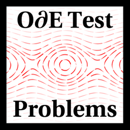
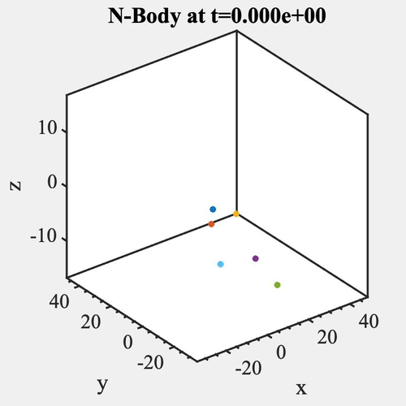
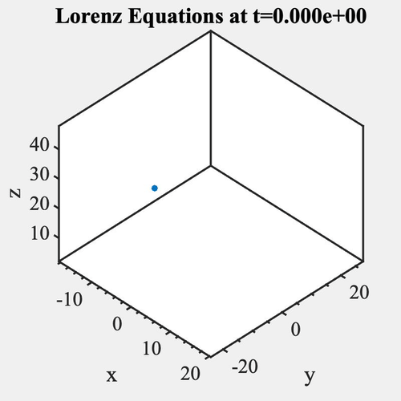
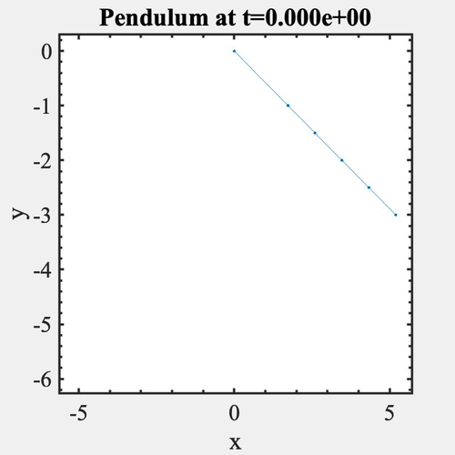
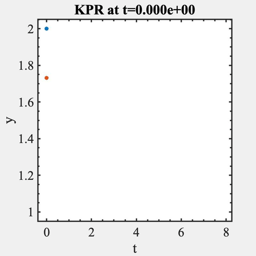

# ODE Test Problems


  
 

 
 
 
 ODE Test Problems (<code>OTP</code>) is an object-oriented Matlab/Octave package offering a broad range of initial value problems in the form of ordinary and differential-algebraic equations that can be used to test numerical methods such as time integration or data assimilation.  It includes problems that are linear and nonlinear, homogeneous and nonhomogeneous, autonomous and nonautonomous, scalar and high-dimensional, stiff and nonstiff, and chaotic and nonchaotic.  Many are real-world problems in fields such as chemistry, astrophysics, meteorology, and electrical engineering.  <code>OTP</code>  also supports partitioned ODEs for testing split, multirate, and other multimethods.  Functions for plotting solutions and creating movies are available for all problems, and exact solutions are included when available. <code>OTP</code> is designed for ease of use &#8212;meaning that working with and modifying problems is simple and intuitive. <code>OTP</code> is actively under development. We are currently writing full documentation in order to release version <code>1.0.0</code>. </p>


[](https://github.com/ComputationalScienceLaboratory/ODE-Test-Problems/actions/workflows/tests.yml)
[](https://github.com/ComputationalScienceLaboratory/ODE-Test-Problems/actions/workflows/docs.yml)

      
 <!--  -->
 
## Installation

OTP can be installed as a local MATLAB toolbox or Octave package by running

```matlab
OTP.install
```

from the root directory of the project. If no longer needed, it can be
uninstalled with `OTP.uninstall`.

## Example

```matlab
% Create a problem
problem = otp.lotkavolterra.presets.Canonical;

% Solve the problem
sol = problem.solve('RelTol', 1e-10);

% Plot the solution
problem.plot(sol);

% Adjust a parameter
problem.Parameters.PreyDeathRate = 2;

% Manually use a MATLAB ODE solver to solve the problem
options = odeset('Jacobian', problem.RHS.Jacobian);
[t, y] = ode15s(problem.RHS.F, problem.TimeSpan, problem.Y0, options);

% Plot the phase space with a custom title
problem.plotPhaseSpace(t, y, 'Title', 'The Circle of Life');

% Create a movie 
mov = problem.movie(t, y);
```

## Further Reading

`ODE Test Problems` documentation is maintained on [this page](https://computationalsciencelaboratory.github.io/ODE-Test-Problems).  

New feature requests, and bug reports can be made through 
[GitHub issues](https://github.com/ComputationalScienceLaboratory/ODE-Test-Problems/issues).
We also accept pull requests that adhere to our
[contributing guide](docs/contrib.rst). 


An interactive tutorial on the main features of `OTP` is available in a Jupyter notebook [in the repository](/notebooks)

Further discussion of the main contributions of this open-source package can be found in our [paper](/paper/paper.md). 
