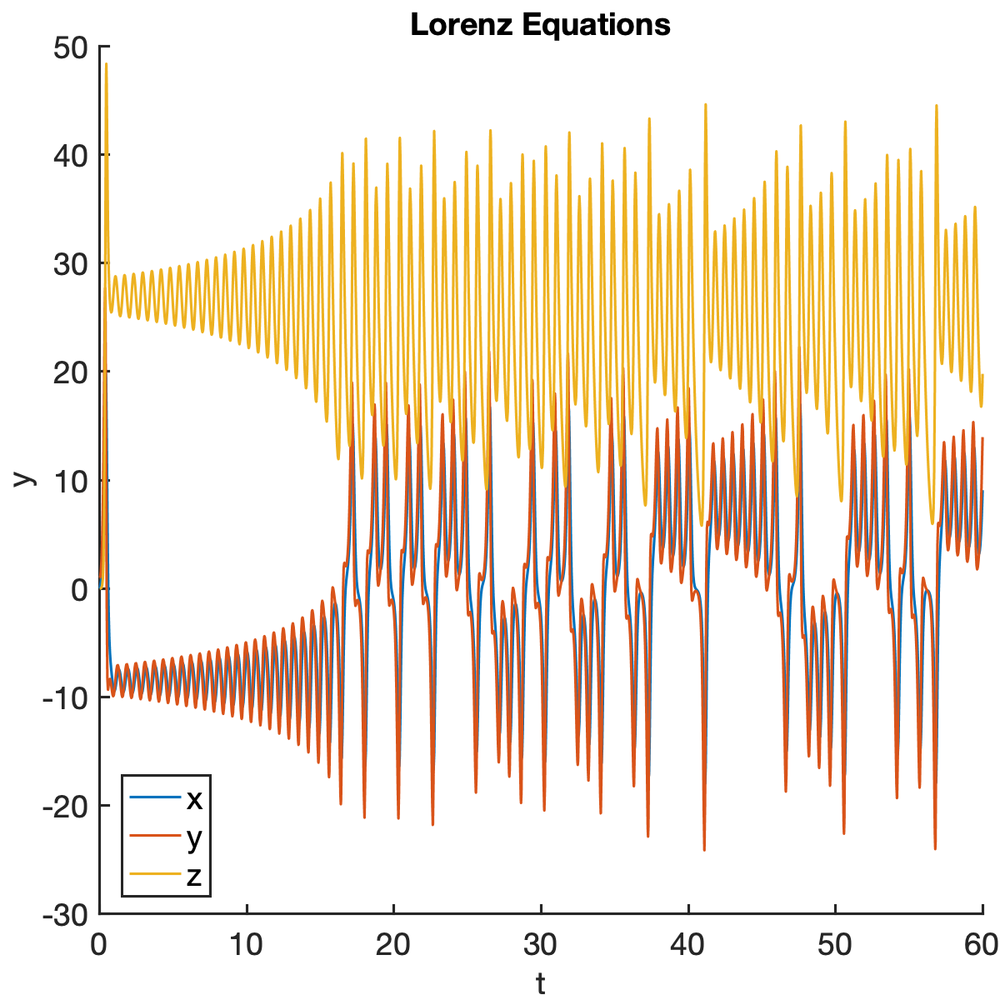
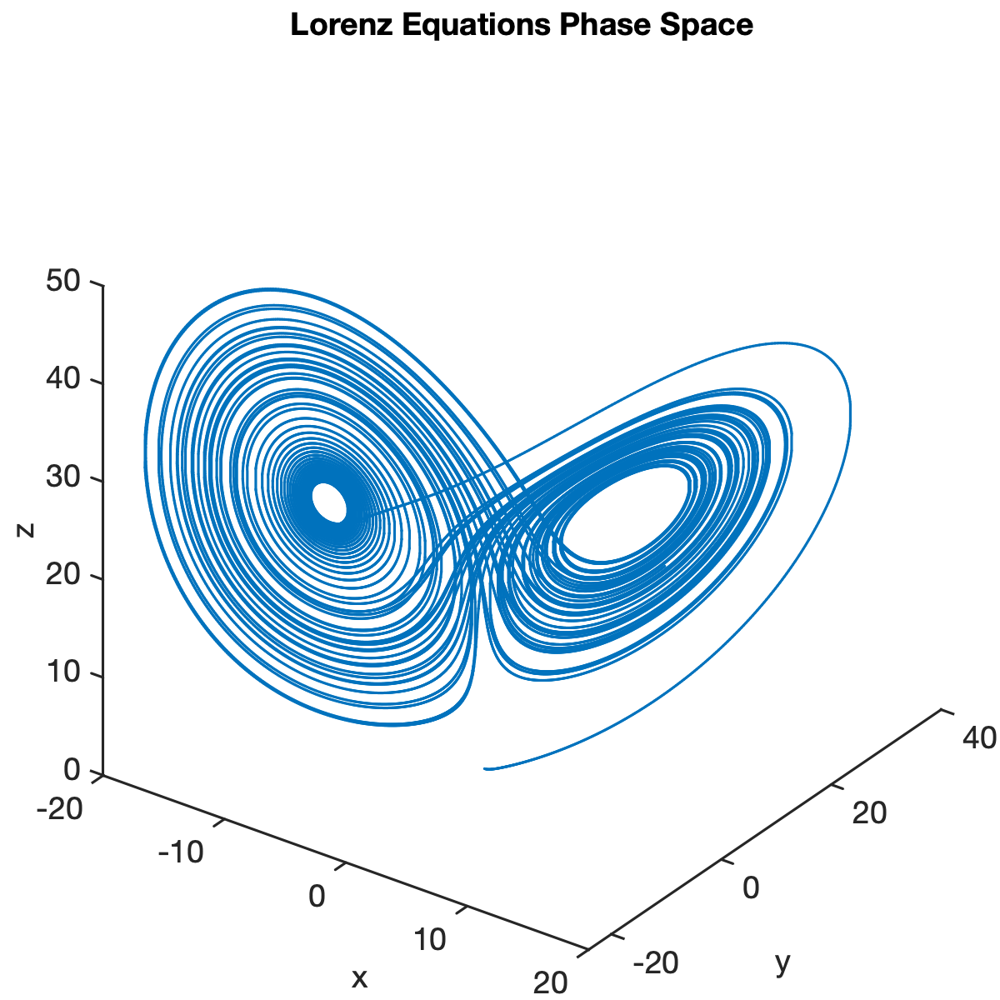

Getting Started
================================================================================

This guide shows you how to create, solve and visualize different problems in
ODE Test Problems (OTP).

Mathematical formulation
------------------------

All test problems in OTP are considered as a first-order differential-algebraic
equation of the form

.. math::

     M(t, y)\;y'(t) = f(t, y), \qquad
     y(t_0) = y_0,

where :math:`y(t)` is the time-dependent solution to the problem,
:math:`f(t, y)` is the right-hand-side function corresponding to the
time-derivative of the system, and :math:`t` is the independent variable. :math:`M(t,y)` is
the mass-matrix for the differential-algebraic system. When the test
problem is an ordinary differential equation, :math:`M` is the Identity
matrix. The initial condition :math:`y_0` specifies the value of
:math:`y` at the initial time :math:`t = t_0`.

Creating problems
---------------------

Any problem in ``OTP`` can be initialized using a *problem name* and a
*preset* that defines a set of specific parameters and initial
conditions. The ``Canonical`` preset is available for all problems.

   >>> problem = otp.lorenz63.presets.Canonical
   <BLANKLINE>
   Canonical with properties:
   <BLANKLINE>
         Name: 'Lorenz Equations'
         RHS: [1×1 otp.RHS]
         TimeSpan: [0 60]
         Y0: [3×1 double]
         Parameters: [1×1 otp.lorenz63.Lorenz63Parameters]
         NumVars: 3

The ``problem`` object contains a number of useful properties including:

-  ``Name``: The name of the problem.
-  ``NumVars``: Number of variables in the state vector.
-  ``Parameters``: Vector of problem-specific parameters that can be
   modified.
-  ``RHS`` : A Right-hand-side structure that includes the ODE
   right-hand-side function and possibly Jacobians, splittings, etc.
   (depending on the test problem)
-  ``TimeSpan``: Time span of the integration.
-  ``Y0``: Initial condition of the problem.

Solving problems
---------------------

Problems can be solved by calling the ``solve()`` method. 

 
   >>> sol = problem.solve()
   <BLANKLINE>
   sol = 
   <BLANKLINE>
   struct with fields:
      solver: 'ode45'
      extdata: [1×1 struct]
            x: [0 2.0095e-05 1.2057e-04 6.2295e-04 0.0031 0.0157 0.0401 0.0752 0.1224 0.1830 0.2582 0.3382 0.3853 0.4325 0.4758 0.5125 0.5552 0.6130 0.6764 … ] (1×820 double)
            y: [3×820 double]
         stats: [1×1 struct]
         idata: [1×1 struct]

``sol.x`` contains the time points at which the solver has calculated the solution and ``sol.y`` contains the solution at these times. 
Optional parameters can be passed to the ``solve()`` method to control the behaviour of the solver. For example:

   >>> sol = problem.solve('MaxStep', 1e-6, 'RelTol', 1e-3 , 'AbsTol', 1e-6);

Visualizing solutions
---------------------

``OTP`` has built-in plotting capabilities for visualizing the computed
solution. The ``plot()`` method can be used to plot the solution
trajectory. The ``plotPhaseSpace()`` method creates a phase-space
diagram by visualizing all spatial-components of the state vector. 

.. code:: matlab

   % Plot the solution trajectory
   problem.plot(sol);

   % Plot the Phase-Space solution 
   problem.plotPhaseSpace(sol);

``OTP`` also supports animations for the computed solution:

.. code:: matlab

   % Create a movie of the solution 
   problem.movie(sol);

.. video:: ../images/animations/Lorenz-original-canonical.webm
   :autoplay:
   :loop:
   :width: 256

Changing the parameters
------------------------
You can change the parameters of the problem by modifying the
``Parameters`` property of the problem object. The solution should be recalculated after updating a parameter.
For example, changing the parameter :math:`\rho` in the Lorenz system leads to a different solution:

.. code:: matlab

   % Change a parameter in the Lorenz system 
   problem.Parameters.Rho = 10

   % Solve the problem again
   sol = problem.solve('MaxStep' , 1e-4);
   problem.movie(sol);

.. video:: ../images/animations/Lorenz-alternate-canonical.webm
   :autoplay:
   :loop:
   :width: 256
   :class: center

Changing the solver
-------------------

OTP uses appropriate internal solvers to integrate each problem.
However, you can plug-in your specific solvers to integrate any test problem by passing the right-hand-side
function, time span, initial condition and other parameters to
the solver. As an example, to use the *Implicit* ``ode23s`` time-stepping method for the Lorenz system, you can use the 
following code:

.. code:: matlab

   sol = ode23s(problem.RHS.F, problem.TimeSpan, problem.Y0, ...
                odeset('Jacobian', problem.RHS.Jacobian));

This is particularly useful when you want to compare the performance of different solvers on the same problem.

Next steps
------------------------
Explore different problems available in OTP by browsing the Problems Gallery in the sidebar. You can define your custom 
problems by creating a new class that inherits from the ``otp.Problem`` class. 
See the `Contributing Guide <../contributing>`_  for more details.
